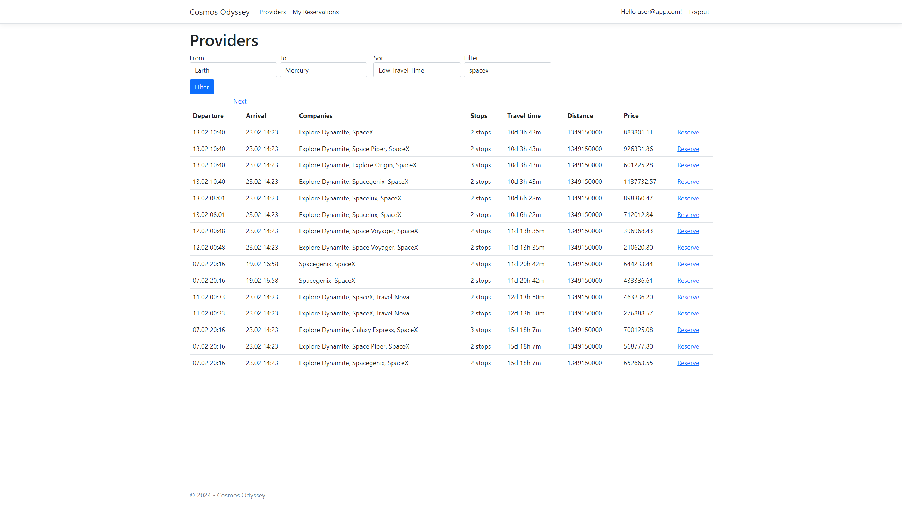

# Cosmos Odyssey

## To run the project
1. Make sure you have docker installed on your machine.
2. Clone the repository.
3. Run `docker-compose up` in the root directory of the project.
4. The project will be available on [`localhost:8080`](http://localhost:8080).
5. Run `docker-compose down` in the root directory of the project if you want to delete the created containers and images.
~~~bash
git clone git@github.com:romatariq/cosmos-odyssey.git
cd cosmos-odyssey
docker-compose up
~~~

## About the app

Cosmos Odyssey is a web application that allows users to reserve flights.
The app is built using the [Cosmos Odyssey API](https://cosmos-odyssey.azurewebsites.net/api/v1.0/TravelPrices).

### Views

